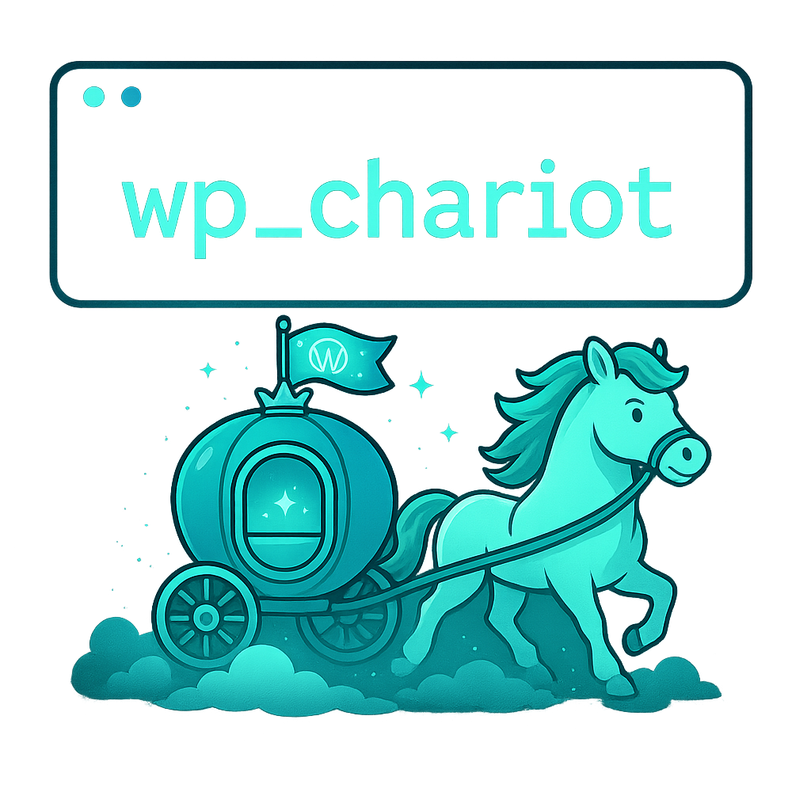

# wp_chariot

<p align="center">
  
</p>

Tools for synchronization, deployment, and patch management in WordPress sites, implemented in Python for an efficient development workflow.

## Philosophy and Purpose

This project was born from the need to democratize the development and maintenance of WordPress-based websites, especially for small businesses and independent developers, under three fundamental principles:

### Digital Autonomy

In a world where dependence on SaaS platforms and multinational service providers is growing exponentially, these tools help maintain sovereignty over digital infrastructure. The ability to easily migrate between hosting providers, efficiently manage environments, and maintain complete control over data becomes critical for sustainable digital survival.

### Economic Accessibility

The pricing models of many commercial solutions are designed for first-world economies, leaving out small entrepreneurs and businesses from emerging economies. This project allows implementing professional and secure workflows without the need for costly subscriptions, making it possible for small businesses to compete digitally without compromising their finances.

### Operational Efficiency

Manual management of WordPress environments consumes valuable time that could be invested in creating real value for clients. These tools automate repetitive synchronization, configuration, and maintenance tasks, allowing developers and business owners to focus on what really matters: creating and growing their projects.

In essence, this project belongs to a new generation of open source tools that, powered by technological advances such as AI, seek to return technological control to independent individuals and businesses, following the tradition of the free software movement and its vision of a more open and accessible internet for all.

## Configuration Philosophy and Workflow

### Single Configuration and Idempotence

This project is based on two fundamental engineering principles:

1. **Split Configuration System**: The project operates with two complementary configuration files:
   - `config.yaml`: Contains global configuration applicable to all sites
   - `sites.yaml`: Defines the specific configuration for each individual site

   This approach allows managing multiple WordPress sites from a single installation of the tools, eliminating inconsistencies and facilitating adaptation to different projects.

2. **Idempotence**: The commands are designed to produce the same final result regardless of how many times they are executed. This allows automating operations without worrying about side effects or intermediate states.

### Multiple Site Management

The system allows operating with multiple WordPress sites from a single installation of the tools, which:

1. **Centralizes Updates**: Maintaining a single copy of the tools allows for easy updates
2. **Avoids Duplication**: It is not necessary to clone the project in each WordPress site
3. **Location Flexibility**: The project can be in any location on your system, not necessarily within the DDEV directory of each site

Each site can have its own complete and independent configuration, and is accessed through a unique alias:

```bash
# Initialize the site system
python deploy-tools/python/cli.py site --init

# Add a site with the current configuration
python deploy-tools/python/cli.py site --add mystore --from-current 

# Add another site (will be created with default configuration that you should edit)
python deploy-tools/python/cli.py site --add othersite

# Set a site as default
python deploy-tools/python/cli.py site --set-default mystore

# List available sites
python deploy-tools/python/cli.py site --list
```

To run any command on a specific site, simply add the `--site` option:

```bash
# Synchronize files for a specific site
python deploy-tools/python/cli.py sync-files --site mystore

# View system information for a site
python deploy-tools/python/cli.py check --site othersite
```

### Recommended Workflow

The typical workflow to start developing on an existing WordPress site is:

#### 1. Initial Setup (one-time)

```bash
# Clone the tools
git clone https://github.com/aficiomaquinas/wp-deploy-tools.git deploy-tools

# Create a site and configure it
cd deploy-tools/python
python cli.py site --init
python cli.py site --add mystore
```

Edit the site configuration file (`sites.yaml`) with:
- Remote server SSH connection data
- Local and remote project paths
- Database configuration
- Exclusion patterns for synchronization (especially `wp-content/uploads/*`)
- Media URL to avoid synchronizing them locally

#### 2. Environment Replication (daily development)

The entire process can be done with a single command:

```bash
# Initialize complete environment (files, DB, and media configuration)
python cli.py init --with-db --with-media --site mystore
```

Or step by step:

```bash
# 1. Synchronize files (excluding media and our custom code)
python cli.py sync-files --site mystore

# 2. Synchronize database
python cli.py sync-db --site mystore

# 3. Configure media paths to use production ones
python cli.py media-path --site mystore

# 4. Verify differences
python cli.py diff --site mystore
```

At this point, you have a fully functional local environment that:
- Contains all WordPress files, plugins, and themes from production
- Has the same database configuration and content
- Uses media directly from the production server
- Is ready for development without having downloaded gigabytes of media files

#### 3. Development and Patches

From here, you can:
- Develop your own plugins and themes that will reside in their own repositories
- Apply patches to third-party plugins as needed
- Test modifications locally before applying them in production

```bash
# Register a patch for a plugin that needs modification
python cli.py patch --add wp-content/plugins/woocommerce/file-to-modify.php --site mystore

# Edit the file locally

# When ready, apply the patch in production
python cli.py patch-commit --site mystore
```

### Complete Automation

This entire process could be automated in a single command thanks to the idempotence of the system. The `init` command allows setting up a complete development environment with a single click, saving valuable time and eliminating human errors in the configuration process.

> 🔍 **Note**: The principle of idempotence is key in this flow. Even if a step fails or is interrupted, you can simply run the same command again and it will continue from where it left off, without unwanted side effects.

### Benefits of this Approach

This workflow solves one of the biggest challenges in WordPress development: the time between deciding to work on a site and having a functional local environment. With this method:

- Setup time is drastically reduced (from hours to minutes)
- No need to download gigabytes of media files that are not part of development
- The database and files exactly reflect production, eliminating surprises
- Changes and patches are applied in a controlled and traceable manner
- Necessary modifications in production can be made safely and consistently
- You can work with multiple sites from a single installation of the tools

In essence, these tools allow developers to focus on creating real value for their clients instead of dealing with repetitive configuration and synchronization tasks.

## Main Features

- **Bidirectional synchronization** of files between local and remote environment
- **Database synchronization** with automatic URL and configuration adjustment
- **Advanced patch management system** for modifying third-party plugins
- **Media path management** for working with CDNs or external media servers
- **Security protections** to prevent accidental changes in production
- **Centralized configuration** through YAML files with environment support
- **Intuitive command-line interface** with commands and subcommands

## Requirements

- Python 3.6 or higher
- SSH configured with access to the remote server
- MySQL/MariaDB (local if using database synchronization)
- For local development: DDEV on UNIX-based OS (only supported at the moment)

## Installation

1. Clone this repository in your WordPress project:
```bash
   git clone https://github.com/aficiomaquinas/wp-deploy-tools.git deploy-tools
   ```

2. Install dependencies:
   ```bash
   cd deploy-tools/python
   pip install -r requirements.txt
   ```

3. Create your configuration file:
   ```bash
   python cli.py config --init
   ```

## Project Structure

```
deploy-tools/python/
├── wp_deploy/                    # Main package
│   ├── __init__.py
│   ├── config_yaml.py            # YAML configuration management
│   ├── commands/                 # Available commands
│   │   ├── __init__.py
│   │   ├── diff.py               # Show differences
│   │   ├── sync.py               # File synchronization
│   │   ├── database.py           # Database synchronization
│   │   ├── patch.py              # Patch application
│   │   ├── site.py               # Multiple site management
│   │   └── media.py              # Media path management
│   ├── utils/                    # Shared utilities
│   │   ├── __init__.py
│   │   ├── ssh.py                # SSH operations
│   │   ├── wp_cli.py             # WP-CLI operations
│   │   └── filesystem.py         # Filesystem operations
├── cli.py                        # CLI entry point
├── config.yaml                   # Global configuration for all sites
├── sites.yaml                    # Specific configuration for each site
├── patches.lock.json             # Applied patches registry
├── setup.py                      # Installation configuration
└── requirements.txt              # Dependencies
```

## Configuration

The system uses YAML configuration files to manage all necessary parameters.

### Configuration Management

The configuration can be customized through the following commands:

```bash
# Show current configuration (global + default site)
python cli.py config --show

# Show configuration for a specific site
python cli.py config --show --site mystore

# Create default configuration files
python cli.py config --init

# Generate a configuration template with explanatory comments
python cli.py config --template

# Verify configuration and system requirements
python cli.py check

# Verify a specific site
python cli.py check --site mystore
```

### Site Management

The multi-site system allows managing several WordPress sites:

```bash
# Initialize the site system
python cli.py site --init

# Add a site with the current configuration
python cli.py site --add mystore --from-current

# Add a new site (with default configuration)
python cli.py site --add othersite

# Set a site as default
python cli.py site --set-default mystore

# List all configured sites
python cli.py site --list

# Remove a site from the configuration (does not delete files)
python cli.py site --remove othersite
```

### Example Configuration Files

#### Global Configuration (config.yaml)

```yaml
# Global configuration for WordPress Deploy Tools
# This file contains common configuration for all sites

# Global WP-CLI settings
wp_cli:
  memory_limit: "512M"  # Memory limit for PHP in WP-CLI

# Default security parameters
security:
  production_safety: "enabled"  # Protection against overwriting in production
  backups: "enabled"  # Create automatic backups before dangerous operations

# Default exclusions (can be overridden per site)
exclusions:
  # Cache and optimization directories
  cache: "wp-content/cache/"
  litespeed: "wp-content/litespeed/"
  
  # Media (by default do not synchronize uploads)
  default-themes: "wp-content/themes/twenty*"
  uploads-by-year: "wp-content/uploads/[0-9][0-9][0-9][0-9]/"

# Default protected files
protected_files:
  - "wp-config.php"
  - "wp-config-ddev.php"
  - ".gitignore"
  - ".ddev/" 

#### Site Configuration (sites.yaml)

```yaml
# Multiple site configuration for WordPress Deploy Tools

# Default site (if multiple are configured)
default: "mystore"

# Individual site configuration
sites:
  mystore:
    ssh:
      remote_host: "my-server"  # SSH alias in ~/.ssh/config
      remote_path: "/path/to/wordpress/on/server/"
      local_path: "/local/path/to/project/app/public/"

    security:
      production_safety: "enabled"  # Protection against overwriting

    urls:
      remote: "https://my-site.com"
      local: "https://my-site.ddev.site"

    database:
      remote:
        name: "db_name"
        user: "db_user"
        password: "secure_password"
        host: "localhost"

    media:
      url: "https://my-site.com/wp-content/uploads/"
      expert_mode: false
      path: "../media"

    # DDEV Configuration
    ddev:
      webroot: "/var/www/html/app/public"

    # Specific exclusions for this site
    exclusions:
      # Custom plugins that should not be synchronized
      my-plugin: "wp-content/plugins/my-custom-plugin/"
      
  othersite:
    ssh:
      remote_host: "other-server"
      remote_path: "/var/www/html/othersite/"
      local_path: "/local/path/othersite/app/public/"
    
    # ... similar configuration for each site
```

## Available Commands

### Verification and Differences

```bash
# Verify configuration and requirements for the default site
python cli.py check

# Verify a specific site
python cli.py check --site mystore

# Show differences between remote server and local (default site)
python cli.py diff

# Show differences for a specific site
python cli.py diff --site mystore

# Show only differences in patched files
python cli.py diff --patches

# Show patch differences for a specific site
python cli.py diff --patches --site mystore
```

### File Synchronization

```bash
# Synchronize files from remote server to local environment (default site)
python cli.py sync-files

# Synchronize files for a specific site
python cli.py sync-files --site mystore

# Synchronize files from local environment to remote server
python cli.py sync-files --direction to-remote

# Synchronize local files to remote for a specific site
python cli.py sync-files --direction to-remote --site mystore

# Simulate synchronization without making changes
python cli.py sync-files --dry-run --site mystore
```

### Database Synchronization

```bash
# Synchronize database from remote server to local environment (default site)
python cli.py sync-db

# Synchronize database for a specific site
python cli.py sync-db --site mystore

# Synchronize database from local environment to remote server (DANGEROUS)
python cli.py sync-db --direction to-remote

# Simulate synchronization without making changes
python cli.py sync-db --dry-run --site mystore
```

### Patch Management

```bash
# List registered patches (default site)
python cli.py patch --list

# List patches for a specific site
python cli.py patch --list --site mystore

# Register a new patch
python cli.py patch --add wp-content/plugins/woocommerce/woocommerce.php --site mystore

# Register a patch with description
python cli.py patch --add --description "Error correction" wp-content/plugins/woocommerce/woocommerce.php --site mystore

# View detailed information about a patch
python cli.py patch --info wp-content/plugins/woocommerce/woocommerce.php --site mystore

# Remove a patch from the registry
python cli.py patch --remove wp-content/plugins/woocommerce/woocommerce.php --site mystore
```

### Patch Application

```bash
# Apply a specific patch
python cli.py patch-commit wp-content/plugins/woocommerce/woocommerce.php --site mystore

# Apply all registered patches
python cli.py patch-commit --site mystore

# Simulate patch application without making changes
python cli.py patch-commit --dry-run --site mystore

# Force application even with modified files
python cli.py patch-commit --force --site mystore
```

### Patch Rollback

```bash
# Revert an applied patch
python cli.py rollback wp-content/plugins/woocommerce/woocommerce.php --site mystore

# Simulate rollback without making changes
python cli.py rollback wp-content/plugins/woocommerce/woocommerce.php --dry-run --site mystore
```

### Media Path Management

```bash
# Configure media paths according to config.yaml (default site)
python cli.py media-path

# Configure media paths for a specific site
python cli.py media-path --site mystore

# Apply configuration on the remote server
python cli.py media-path --remote --site mystore

# Show detailed information during configuration
python cli.py media-path --verbose --site mystore
```

Media path management allows configuring custom URLs for WordPress media files, facilitating:

- Used in combination with exclusions (for example wp-content/uploads/{year}) reduces the time it takes to make the local development environment work.
- Use CDNs or external media servers to improve performance and reduce the startup time of the local development environment, avoiding having to synchronize media that can be very heavy directories and that are generally static and not usually involved with the operation of the site (generally they do not have scripts).
- Maintain media files in locations independent of code
- Configure development environments to work with media from production
- Implement optimal storage strategies according to budget and needs

The command automatically installs and configures the "WP Original Media Path" plugin using the values defined in the `media` section of the configuration file:

```yaml
media:
  url: "https://media.mydomain.com/wp-content/uploads/"  # URL for media files
  expert_mode: false  # Activate expert mode for custom physical paths
  path: "/absolute/path/to/uploads"  # Physical path (only with expert_mode: true)
```

## Patch System

The patch system allows maintaining modifications to third-party plugins and themes in an organized and traceable manner:

### Operation

1. **Patch Registry**: Patches are registered in a `patches.lock.json` file
2. **Checksum Verification**: Checksums are compared to detect changes in files
3. **Automatic Backup**: Backups are created before applying patches
4. **Traceability**: Records who applied each patch and when

### Patch States

The system can display different states for each patch:

- **⏳ Pending**: Registered but not applied
- **✅ Applied**: Correctly applied and current
- **⚠️ Orphaned**: The local file has changed since it was registered
- **🔄 Obsolete**: Patch applied but local file modified afterward
- **❌ Misaligned**: Applied but remote file has been modified
- **📅 Expired**: Obsolete patch because the remote version has changed

### Patch System Philosophy

The patch system addresses a fundamental problem in the WordPress ecosystem: the need to modify third-party code while maintaining the integrity of the update cycle.

#### Why Patches Instead of Complete Forks?

While some expensive commercial solutions offer "atomic" environments with fully versioned repositories (such as Pantheon or RunCloud Enterprise), this approach:

1. **Respects Original Versioning**: The code is already versioned by its authors on WordPress.org. Creating a parallel complete versioning system is redundant and inefficient.

2. **Maintains Shared Responsibility**: A patch by definition acknowledges that we are modifying something that is not ours, but assuming responsibility for that modification.

3. **Facilitates Updates**: By maintaining a clear record of specific modifications, it is easier to determine if a patch is still necessary after an update.

4. **Reduces Operational Complexity**: Managing a separate repository for each modified plugin generates unnecessary complexity in the workflow.

This simple but effective approach helps keep WordPress secure and functional without sacrificing customization capability or incurring high costs for commercial solutions that essentially do the same thing in a more complex way.

> 💡 **Note:** In the future, it could be integrated with integrity verification systems (Malcare, Wordfence, Jetpack) of popular plugins to handle exceptions specific to patched versions, without affecting verification in future versions when the author updates the code.

## Security Features

1. **Production Environment Protection**
   - If `production_safety` is enabled, it runs in simulation mode
   - Requires explicit confirmation for critical operations

2. **File Protection**
   - System to identify and protect critical files
   - Requests confirmation before overwriting important files

3. **Automatic Backups**
   - Creation of backups before destructive operations
   - Backups with unique names based on timestamps

4. **Checksum Verification**
   - Detection of changes through MD5 checksums
   - Avoids applying patches to modified files

## Next Steps

The project now focuses on:

1. **Improve DDEV integration** for an even smoother experience
2. **Automatic update system** to facilitate tracking improvements
3. **Integration tests** to validate complete functionality
4. **Performance optimization** in projects with a lot of content
5. **Automatic detection and management of patched plugins** in integrity verification systems
6. **Advanced migration capabilities** to simplify changes between hosting providers

## License

This project is free software under the [MIT](LICENSE) license. 