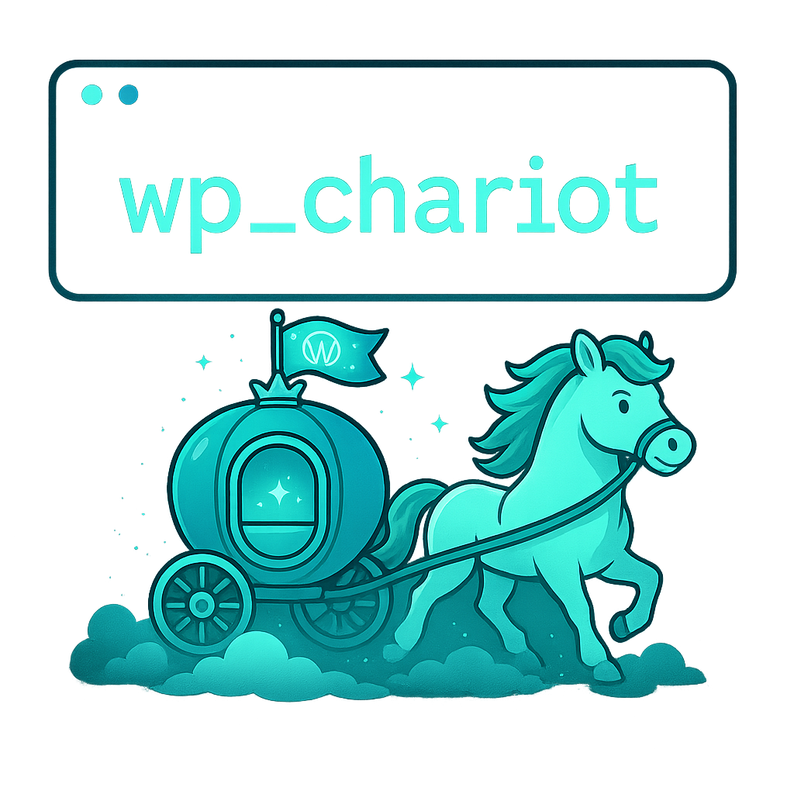

<p align="center">
  
</p>

# wp_chariot

> Spin up idempotent WordPress dev environments with one click. Synchronize bidirectionally between local and production. Only requires SSH on your server and DDEV/Python on your local machine. Designed to save time for freelancers and small agencies working with WordPress.

**PRE-RELEASE: Don't use on important production sites until it gets tested by more people.**

## Table of Contents
- [Overview](#overview)
- [Main Features](#main-features)
- [Requirements](#requirements)
- [Quick Start](#quick-start)
- [Documentation](#documentation)
- [License](#license)

## Overview

wp_chariot allows WordPress developers to:

1. **Set up local development environments in minutes**, not hours
2. **Synchronize files bidirectionally** between local and production environments
3. **Apply patches to third-party plugins** in a controlled, traceable manner
4. **Avoid downloading gigabytes of media files** while maintaining full functionality
5. **Save time and money** while maintaining professional workflows

All of this with minimal requirements on both local and server environments, using standard tools like SSH and rsync.

## Main Features

- **Bidirectional synchronization** of files between local and remote environment
- **Database synchronization** with automatic URL and configuration adjustment
- **Advanced patch management system** for modifying third-party plugins
- **Media path management** for working with production media directly
- **Multi-site management** from a single installation
- **Security protections** to prevent accidental changes to production
- **Idempotent operations** that can be safely repeated

## Requirements

### Local Machine
- Unix-based OS (Linux/macOS)
- Python 3.6 or higher
- DDEV installed
- SSH access to your remote server

### Remote Server
- Unix-based server with PHP
- WP-CLI installed
- SSH access
- MySQL/MariaDB access with user credentials
- Regular user permissions to WordPress files and database

For detailed compatibility information, see the [Compatibility Guide](docs/compatibility.md).

## Quick Start

```bash
# Clone the tool OUTSIDE your WordPress installation
git clone https://github.com/aficiomaquinas/wp_chariot.git ~/wp_chariot

# Set up your environment
cd ~/wp_chariot/python
pip install -r requirements.txt
cp config.example.yaml config.yaml
cp sites.example.yaml sites.yaml

# Edit configuration files with your site details
vim sites.yaml

# Initialize and set up your first site
python cli.py site --init
python cli.py site --add mysite
python cli.py init --with-db --with-media --site mysite
```

For detailed installation instructions, see the [Installation Guide](docs/installation.md).

## Documentation

Comprehensive documentation is available in the `docs/` directory:

- [Installation Guide](docs/installation.md) - Detailed installation instructions
- [Configuration Files](docs/configuration-files.md) - Guide to configuration files structure and options
- [Command Reference](docs/commands-reference.md) - Complete list of all available commands
- [Workflow Guide](docs/workflow.md) - Detailed workflow explanation with diagrams
- [FAQ](docs/faq.md) - Frequently asked questions
- [Troubleshooting](docs/troubleshooting.md) - Solutions to common problems
- [Security Considerations](docs/security.md) - Security best practices
- [Compatibility](docs/compatibility.md) - Version requirements and compatibility information
- [External Resources](docs/resources.md) - Additional resources and references
- [Contributing](CONTRIBUTING.md) - How to contribute to the project

## License

This project is free software under the [MIT](LICENSE) license.
