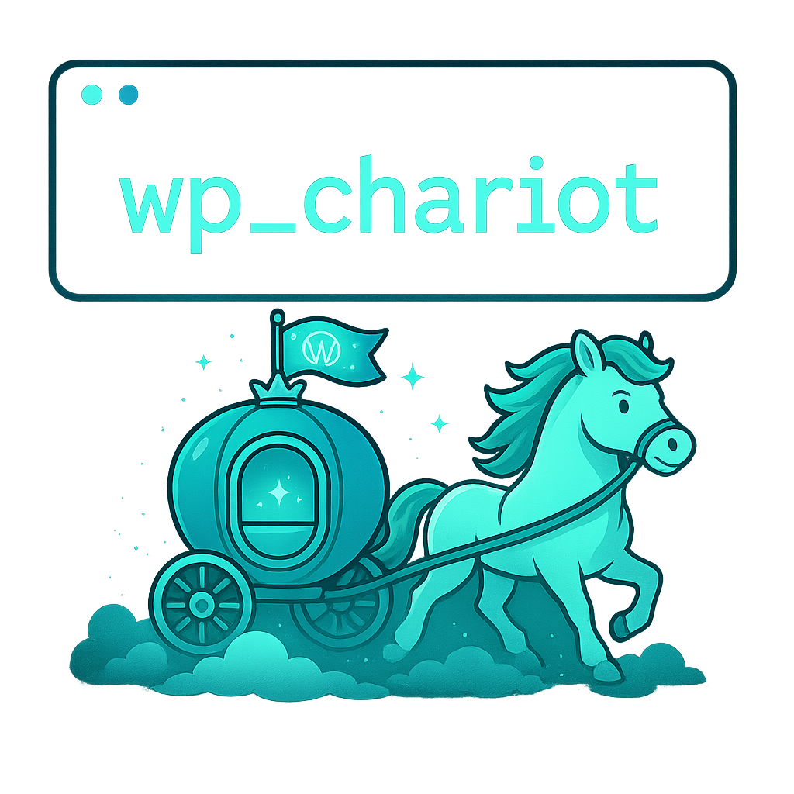

<p align="center">
  
</p>

# wp_chariot

> **Declarative, deterministic, and idempotent WordPress environments.**

`wp_chariot` brings an Infrastructure as Code (IaC) approach to WordPress local development and remote synchronization. Instead of manual setups and brittle sync scripts, you define your entire environment—SSH connections, database handling, path mappings, and security exclusions—in a single `sites.yaml` file.

Spin up identical local environments and execute strict, unidirectional synchronizations between local DDEV and production servers. Designed to eliminate configuration drift, save hours of setup time, and protect production data for freelancers and agencies.

**BETA: Mostly tested, but use with caution on important production sites until it gets tested by more people.**

## Table of Contents

- [Overview](#overview)
- [Main Features](#main-features)
- [Requirements](#requirements)
- [Quick Start](#quick-start)
- [Documentation](#documentation)
- [License](#license)

## Overview

wp_chariot allows WordPress developers to:

1. **Set up local development environments in minutes**, not hours
2. **Synchronize files bidirectionally** between local and production environments
3. **Apply patches to third-party plugins** in a controlled, traceable manner
4. **Avoid downloading gigabytes of media files** while maintaining full functionality
5. **Save time and money** while maintaining professional workflows

All of this with minimal requirements on both local and server environments, using standard tools like SSH and rsync.

## Main Features

- **Declarative Configuration**: A single `sites.yaml` file dictates the complete state and behavior of your environments.
- **Idempotent Operations**: Run sync or initialization commands safely as many times as you want.
- **Deterministic Outcomes**: Eradicates "it works on my machine" issues by leveraging standard configuration alongside DDEV.
- **Explicit Unidirectional Sync**: While bidirectional sync is technically supported, the architecture advocates for separate, strictly unidirectional configurations (e.g., distinct "Pull-Only" mapping and "Push-Only" mappings) for absolute safety against accidental overwrites.
- **Strict Security Protections**: Built-in production safety checks (`production_safety: enabled`) prevent catastrophic accidental pushes.
- **Advanced patch management system** for modifying third-party plugins in a controlled, traceable manner.
- **Media path management** to serve production media directly without downloading gigabytes of uploads.
- **Multi-site readiness** to manage dozens of sites from a single centralized installation.

## Requirements

### Local Machine

- Unix-based OS (Linux/macOS)
- Python 3.8 or higher
- uv installed ([installation guide](https://docs.astral.sh/uv/getting-started/installation/))
- DDEV installed
- SSH access to your remote server (**SSH Keys only**, password-based auth/sshpass is not supported)

### Remote Server

- Unix-based server with PHP
- **Web Server**: Nginx or Angie (optional but recommended for caching integration)
- **Object Cache**: Redis (optional but recommended)
- WP-CLI installed
- SSH access
- MySQL/MariaDB access with user credentials
- **CRITICAL: Pool Isolation**. The remote user must have standard permissions to WordPress files and the database, but it is *highly* recommended that the server enforces OS-level user isolation per site (e.g. PHP-FPM pools running as specific users).

> **Note**: This tool provides out-of-the-box optimization specifically tuned for `tt-wordpress-automation` and SporeHarbor deployments. However, it is fundamentally agnostic and remains compatible with general LEMP architectures, RunCloud distributions, or similar control panels that adhere to standard user isolation practices.

For detailed compatibility information, see the [Compatibility Guide](docs/compatibility.md).

## Quick Start

```bash
# Clone the tool OUTSIDE your WordPress installation
git clone https://github.com/aficiomaquinas/wp_chariot.git ~/wp_chariot
cd ~/wp_chariot/python

# Create virtual environment and install dependencies
uv venv
source .venv/bin/activate  # On Windows: .venv\Scripts\activate
uv sync

# Set up your declarative configuration
cp config.example.yaml config.yaml
cp sites.example.yaml sites.yaml

# Define your environment mapping and credentials
vim sites.yaml

# Initialize CLI state
wpchariot site --init

# Execute an explicit, unidirectional synchronization (Push-Only example)
# This will push DB, file changes, handle infrastructure plugins, and safely clear remote caches
wpchariot sync-all --direction to-remote --with-infra --site mysite-staging --yes
```

For detailed installation instructions, see the [Installation Guide](docs/installation.md).

## Documentation

Comprehensive documentation is available in the `docs/` directory:

- [Installation Guide](docs/installation.md) - Detailed installation instructions
- [Configuration Files](docs/configuration-files.md) - Guide to configuration files structure and options
- [Command Reference](docs/commands-reference.md) - Complete list of all available commands
- [Workflow Guide](docs/workflow.md) - Detailed workflow explanation with diagrams
- [FAQ](docs/faq.md) - Frequently asked questions
- [Troubleshooting](docs/troubleshooting.md) - Solutions to common problems
- [Security Considerations](docs/security.md) - Security best practices
- [Compatibility](docs/compatibility.md) - Version requirements and compatibility information
- [External Resources](docs/resources.md) - Additional resources and references
- [Contributing](CONTRIBUTING.md) - How to contribute to the project

## License

This project is free software under the [MIT](LICENSE) license.
